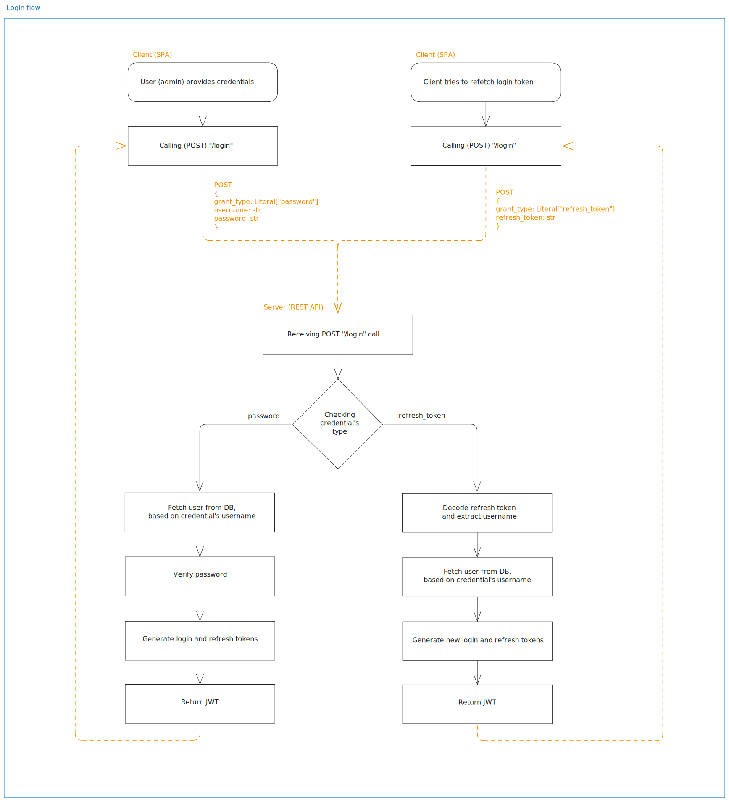

# marek_onpc.github.io
## Description
This repository contains a codebase for my personal project, a web application for managing cheat sheets, code snippets, and other useful information. The application consists of a backend server built with Python + FastAPI and a frontend client developed using SvelteKit (SPA).

I'm always trying to modify and improve the codebase. If I can, I will add new features, fix bugs, or refactor existing code to make it cleaner and more efficient. It serves as a personal project to enhance my skills in web development and software engineering - a programming playground.

**Architecture overview:**

    
<strong>Login flow</strong>

    

 

## Development plan, improvements

-  **DONE** ~~Refactor server codebase, use typed models and schemas, implement linters and formatters (Python)~~
-  **DONE** ~~Add cheat sheet/snipped full view modal (client application)~~
-  **DONE** ~~Refactor server's databaseconenction class (singleton)~~
-  **DONE** ~~Refactor authentication flow (to cover password and refresh token login)~~
-  **DONE** ~~Adjust client to reauthenticate with refresh token~~
- **IN PROGRESS** Create a full architecture and data flow diagrams
- **PLANNED** Create a async logging/history system based on AMQP
- **PLANNED** Add Github Actions for CI/CD (test flows)
- **PLANNED** Fully test client codebase
- **PLANNED** Add a search engine for the cheat sheets (based on content)

 

## Commands
### Server

Run those from the `./server` directory.

#### Run server
`poetry run uvicorn main:app --host 0.0.0.0 --port 8000`

#### Tests
`poetry run python -m pytest . -vv`

#### Formatting, types, imports
`isort . && black . && flake8 . && mypy .`

---
### Dockerized server

#### Build image
`docker build -t server .`

#### Run container
`docker run -dp 8000:8000 server`

---
### Client

Run those from the `./client` directory.

#### Run dev server (SvelteKit)
`yarn dev`

#### Build client
`yarn build`

#### Tests
`yarn test`

#### Format, types, imports
`yarn format && yarn check && yarn lint`
